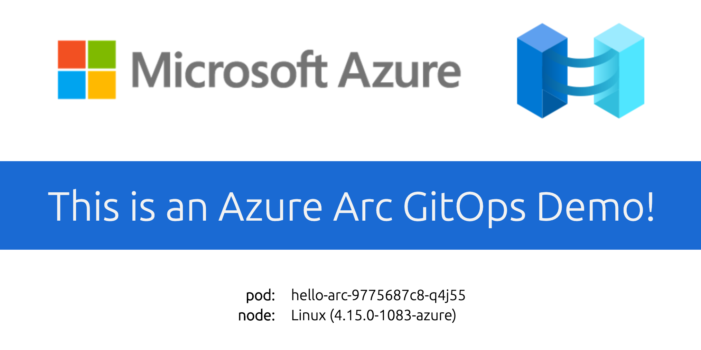

# Hello Arc Overview

This container image can be deployed on a Kubernetes cluster. When accessed via a web browser on port 8080, it will display:

* "Hello World" message
* Kubernetes pod name
* Node os information

It is designed for demoing Azure Arc for Kubernetes GitOps flow included in the ["Azure Arc Jumpstart GitHub repository"](https://github.com/likamrat/azure_arc/) but can really be used for other demo purposes easily. 

## Credit

This repository and the "Hello Arc" application in it were forked from the great work done by Paul Bouwer as part of his ["Hello Kubernetes" GitHub repository](https://github.com/paulbouwer/hello-kubernetes) and all credits for the building blocks goes to him. 

Please refer to the repository for detailed instructions on how to build your on Docker image and deploy it. 

## Docker Hub

The container for this "Hello Arc" application can be found on [Docker Hub](https://hub.docker.com/r/liorkamrat/hello-arc). 

## Contributing

Before contributing code, please see the [CONTRIBUTING](CONTRIBUTING.md) guide.

Issues, PRs and Feature Request have their own templates. Please fill out the whole template.